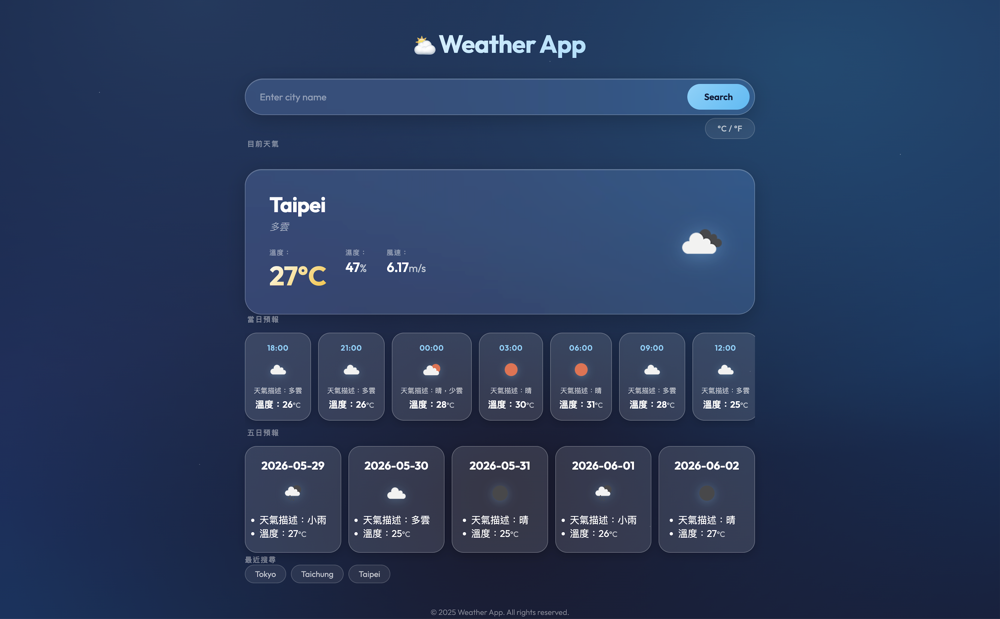

# Weather App

A responsive weather application built with vanilla JavaScript, HTML, and CSS. Focused on real-world API integration, asynchronous data handling, and a polished glassmorphism UI.

**[Live Demo](https://lutingdin.github.io/weather-app/)** | **[GitHub](https://github.com/LuTingDin/weather-app)**



## Features

- Search any city to display current weather conditions (temperature, humidity, wind speed, weather icon)
- Hourly forecast showing the next 24 hours in 3-hour intervals
- 5-day forecast displaying daily weather at noon
- Temperature unit toggle between Celsius and Fahrenheit
- Recent searches saved via localStorage (up to 3 cities, case-insensitive deduplication)
- Full error handling for invalid cities and network failures
- Loading state during API requests

## Tech Stack

- HTML5 / CSS3 / JavaScript (ES6+)
- OpenWeatherMap API for weather data
- localStorage for client-side state management
- No frameworks or libraries

## Architecture

- ES6 module system with separated concerns across four files:
  - `config.js` — API key and base URL constants
  - `api.js` — all fetch logic with error handling and data filtering
  - `ui.js` — DOM manipulation and rendering functions
  - `app.js` — application logic, event listeners, and state management
- Unidirectional data flow — `app.js` fetches data and passes it to `ui.js` for rendering; UI layer has no knowledge of the API
- `Promise.all` for parallel API requests to minimize load time
- Error bubbling pattern — `api.js` detects and throws errors, `app.js` decides how to present them to the user

## Getting Started

1. Clone the repo
```bash
git clone https://github.com/your-username/weather-app.git
```

2. Create your `config.js` based on the provided example
```bash
cp js/config.example.js js/config.js
```

3. Add your OpenWeatherMap API key to `config.js`
```javascript
export const API_KEY = 'your_api_key_here';
```

4. Open `index.html` with Live Server (VS Code extension)

## API

This project uses the [OpenWeatherMap API](https://openweathermap.org/api) (free tier).

- `GET /weather` — current weather by city name
- `GET /forecast` — 5-day forecast in 3-hour intervals